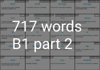
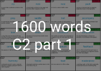

Trong [bài viết trước]() mình đã chia sẻ file PDF của flashcard cho các từ vựng của Oxford. Và sau đó thì mình có khám phá ra từ điển của Cambridge có nhiều ưu điểm hơn nên quyết định tạo file và chia sẻ trong bài viết này.
##### Từ điển Cambridge có gì hơn từ điển Oxford

Trước đây mình sử dụng từ điển Oxford để tạo flashcard và tra từ điển cũng như dùng để học từ vựng mới và gần đây mình chuyển qua dùng từ điển Cambirdge do đang luyện thi IELTS. Thì mình thấy có một số ưu điểm của Cambridge như sau:

- Từ điển Cambridge có gom nhóm theo chủ đề (20 topics).
- Từ điển Cambridge phân biệt các từ giống nhau nhưng nghĩa khác nhau bằng `guide word`. Ví dụ **concern** có thể là `WORRY` hoặc `IMPORTANT THING`.
- Ví dụ trong Oxford hầu hết mang hướng học thuật trong khi đó từ điển Cambridge có phân chia ra loại ví dụ thông thường và ví dụ học thuật nên có thể lựa chọn theo nhu cầu của bản thân. Và theo mình thì ví dụ dạng `general` sẽ dễ nhớ và dễ hiểu hơn ví dụ `academic`. 

### Vấn đề và giải pháp

##### Vấn đề
Cần tạo ra một file PDF có kích thước bằng tờ giấy A4 chứa các flashcard từ danh sách các từ của Cambridge từ cấp độ cơ bản(A1-A2) đến trung cấp(B1-B2) và cao cấp (C1-C2) để người dùng có thể cắt ra thành các flashcard nhỏ. Và trên các flashcard nhỏ phải chứa đầy đủ thông tin. Ví dụ: từ vựng, loại từ, phát âm, định nghĩa, ví dụ, chủ đề, và `guide word`.
##### Giải pháp

**Bước 1:** Crawl toàn bộ từ vựng từ Cambridge. Vì các `url` dẫn đến các từ được đánh chỉ mục theo số thứ tự tăng dần nên có thể sử dụng 1 vòng for để tải toàn bộ.

**Bước 2:** Crawl toàn bộ từ vựng trong bảng [English Vocabulary Profile Online](https://www.englishprofile.org/wordlists/evp) vì chỉ các từ trong này mới được chia theo chủ đề(topic).

**Bước 3:** là thiết kế  giao diện cho flashcard. Dựa theo cách mình đã học thì mình có thiết kế [giao diện như sau trên Figma](https://www.figma.com/file/Bo5KWQFiWcuZRTCA6oM7lE/Untitled?node-id=0%3A1).

**Bước 4:** viết một Python script để tự động tạo file HTML(chứa nhiều flashcard) và chèn các dữ liệu được crawl từ Cambridge về vào trong file HTML đó.

**Bước 5:** mở file HTML được tạo bằng trình duyệt duyệt Chrome và và xuất trang đó dưới dạng PDF.

### Hướng dẫn sử dụng code
Vì mình đã crawl toàn bộ dữ liệu và xuất file PDF theo level từ nên không có bước hướng dẫn sử dụng.
### Một khó khăn trong quá trình code và kết quả

##### Một số khó khăn trong quá trình code

- Mình cần chừa lại một ô vuông ô dưới cùng bên trái để xỏ khoen, nếu sử dụng `len(text)` thì không khả dụng do chiều dài của các chữ các khác nhau là khác nhau. Từ đó mình tìm cách đo chiều dài thực tế của các chữ cái nhờ vào thư viện `fontTools`.
- Kích thước A4 của Google khác với kích thước của A4 thực tế nên dù cho khi xuất file PDF rất khít nhưng khi in lại bị lệch theo chiều ngang - margin bên trái khác margin bên phải dẫn tới bị lệch giữa mặt trước và mặt sau. Từ đó sẽ mất chữ sau khi cắt nhỏ flashcard. Không xảy ra lỗi khi **in màu**.
- Nếu số lượng từ quá lớn (từ 2500 từ)thì trong quá trình xuất file PDF từ HTML sẽ bị lỗi. Cách khắc phục là chia nhỏ HTML thành các phần khác nhau.
- Vấn đề khi hợp nhất 2 file crawl, không phải từ vựng của Cambridge nào cũng được liệt kê trong bảng **EVP** dẫn tới dữ liệu thừa.s

##### Kết quả

Đây là hình ảnh file PDF trên máy tính

Và đây là hình ảnh thực tế sau khi mình in ra

Còn đây là hình ảnh sau khi hoàn thiện các bước

### Một số lưu ý khi sử dụng PDF này
- Các chủ đề của từ được phân biệt theo màu sắc tại `guide word`, bạn có thể xem giải mã màu sắc tại `topic color` phía trên.
- Nên tải và in file demo trước khi thực hiện in hàng loạt.
- Máy in có 2 chế độ in là theo chiều dọc và ngang, bạn chọn chế độ **in ngang**
- Khuyến nghị nên in màu để có thể phân biệt các topic cũng như để mặt trước và mặt sau của flashcard không bị lệch.
- Và phải in trên giấy cứng, tối thiểu định lượng giấy in là **180gsm** và khuyến nghị định lượng nên là từ **300gsm**.
- Phải cắt bằng tay nên có thể lệch-tùy thuộc hoa tay của các bạn, nếu bạn có bàn cắt thì sẽ nhanh và ngay ngắn hơn.
- Phải bấm lỗ để xỏ khoen bằng tay, khá là đau tay :(
- Và nếu muốn xâu flash card thành chuỗi thì bạn cần mua thêm [kìm bấm lỗ`](https://shopee.vn/K%C3%ACm-b%E1%BA%A5m-l%E1%BB%97-i.8865912.149324473) và  [khoen tròn flashcard](https://www.google.com/search?q=khoen+v%C3%B2ng+flashcard&sxsrf=APq-WBts2jGsQGqAN3-27ekYe4qBSrD0kQ:1647415400663&source=lnms&tbm=shop&sa=X&ved=2ahUKEwiS0oPOjMr2AhXIyYsBHc0yCfQQ_AUoAHoECAIQCQ&biw=1745&bih=806&dpr=1.1)

### Link tải một số file PDF đã được chuẩn bị sẵn

### Tài liệu tham khảo
[EVP](https://www.englishprofile.org/wordlists/evp)